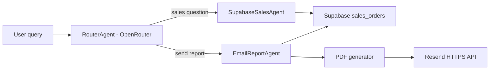

# Ecommerce Sales Multi-Agent

A Python multi-agent solution for an ecommerce company. It can:

- Generate fake sales data with Faker.
- Store the generated sales data in Supabase.
- Route a natural-language request with an OpenRouter LLM.
- Query Supabase for sales summaries.
- Generate a PDF sales report.
- Send the PDF report through the Resend email API.
- Use a Streamlit chat UI for browser-based querying.
- Run locally as a CLI or API.
- Deploy to Railway.

## Architecture



## 1. Create the Supabase Table

Open your Supabase project, go to **SQL Editor**, and run the SQL in:

```bash
supabase_schema.sql
```

Use your Supabase **service role key** for this backend service because it inserts and reads sales rows.

## 2. Configure Environment Variables

Create a local `.env` file:

```bash
cp .env.example .env
```

Fill these values:

```env
SUPABASE_URL=https://your-project.supabase.co
SUPABASE_SERVICE_ROLE_KEY=your-service-role-key
SUPABASE_SALES_TABLE=sales_orders

OPENROUTER_API_KEY=your-openrouter-api-key
OPENROUTER_MODEL=openai/gpt-4o-mini
OPENROUTER_SITE_URL=http://localhost:8000
OPENROUTER_APP_NAME=Ecom Sales Agent

RESEND_API_KEY=
EMAIL_FROM=Your Store <reports@your-verified-domain.com>
EMAIL_RECIPIENT=recipient@example.com

REPORT_OUTPUT_DIR=reports
SEED_DEFAULT_ROWS=250
```

The app sends email through Resend over HTTPS. Add:

```env
RESEND_API_KEY=your-resend-api-key
EMAIL_FROM=Your Store <reports@your-verified-domain.com>
EMAIL_RECIPIENT=recipient@example.com
```

`EMAIL_FROM` must be a verified sender or domain in Resend. For initial testing, Resend may only allow sending to your verified account email.

You can confirm the exact `.env` file and masked email settings being loaded with:

```bash
python -c "from app.config import settings_debug_summary; from app.emailer import email_debug_summary; print(settings_debug_summary()); print(email_debug_summary())"
```

## 3. Run Locally

Create and activate a virtual environment:

```bash
python3 -m venv .venv
source .venv/bin/activate
```

Install dependencies:

```bash
pip install -r requirements.txt
```

## 4. Run the Streamlit Chat UI Locally

After creating `.env`, installing dependencies, and creating the Supabase table, start the chat UI:

```bash
streamlit run streamlit_app.py
```

Streamlit will open a local browser page, usually:

```text
http://localhost:8501
```

In the UI:

1. Use the sidebar **Generate sales data** button to create fake ecommerce sales rows in Supabase.
2. Ask sales questions in the chat box.
3. Ask for reports with prompts like `Send a PDF sales report to my email`.
4. Optionally enter a one-off recipient email in the sidebar before asking for a report.
5. Download the generated PDF from the chat response if you want a local copy.

Example chat prompts:

```text
What are my top products this month?
Summarize gross revenue and top regions.
Send a PDF sales report to my email.
Email the latest sales report to finance@example.com.
```

## 5. Optional CLI Usage

Seed fake ecommerce sales data into Supabase:

```bash
python cli.py seed --rows 500
```

Ask a sales question:

```bash
python cli.py ask "What are my top sales categories this month?"
```

Generate and email a PDF report:

```bash
python cli.py ask "Send a PDF sales report to my email"
```

Send to a one-off recipient:

```bash
python cli.py ask "Email the latest sales report" --recipient someone@example.com
```

## 6. Run as an API

Start the FastAPI server:

```bash
uvicorn app.main:app --reload --port 8000
```

Health check:

```bash
curl http://localhost:8000/health
```

Seed data:

```bash
curl -X POST "http://localhost:8000/seed?rows=500"
```

Ask the agent:

```bash
curl -X POST http://localhost:8000/agent \
  -H "Content-Type: application/json" \
  -d '{"query":"Summarize total sales and top products"}'
```

Email report:

```bash
curl -X POST http://localhost:8000/agent \
  -H "Content-Type: application/json" \
  -d '{"query":"Send my sales PDF report to my email"}'
```

## 7. Deploy to Railway

1. Push this project to GitHub.
2. Create a new Railway project from that GitHub repo.
3. Add the same `.env` values in Railway **Variables**.

Railway does not use your local `.env` file at runtime. Add these variables in the Railway service settings:

```text
SUPABASE_URL
SUPABASE_SERVICE_ROLE_KEY
SUPABASE_SALES_TABLE
OPENROUTER_API_KEY
OPENROUTER_MODEL
OPENROUTER_SITE_URL
OPENROUTER_APP_NAME
EMAIL_FROM
EMAIL_RECIPIENT
RESEND_API_KEY
REPORT_OUTPUT_DIR
SEED_DEFAULT_ROWS
```

Minimum required Railway variables:

```text
SUPABASE_URL
SUPABASE_SERVICE_ROLE_KEY
OPENROUTER_API_KEY
RESEND_API_KEY
EMAIL_FROM
EMAIL_RECIPIENT
```

Use these email values on Railway:

```text
RESEND_API_KEY=your-resend-api-key
EMAIL_FROM=Your Store <reports@your-verified-domain.com>
EMAIL_RECIPIENT=recipient@example.com
```

The app does not use Gmail SMTP. Resend sends through HTTPS, which avoids Railway's SMTP block.

Deploy this repo as one Railway service.

Start command:

```bash
./start.sh
```

This runs:

```bash
streamlit run streamlit_app.py --server.address=0.0.0.0 --server.port=$PORT --server.headless=true
```

It also starts FastAPI internally with:

```bash
uvicorn app.main:app --host 0.0.0.0 --port $API_PORT
```

The public Railway URL points to Streamlit because Streamlit uses Railway's `$PORT`. FastAPI runs internally on `API_PORT`, default `8000`.

After deployment, seed data from the Streamlit sidebar. If you expose/use the internal FastAPI service separately, the seed endpoint is:

```bash
curl -X POST "https://your-railway-domain.up.railway.app/seed?rows=500"
```

The FastAPI agent endpoint is:

```bash
curl -X POST https://your-railway-domain.up.railway.app/agent \
  -H "Content-Type: application/json" \
  -d '{"query":"Send a PDF sales report to my email"}'
```

Use the main Railway service URL for the browser chat UI.

## Query Examples

Sales data questions:

```text
What is my gross revenue?
What are the top 5 products by revenue?
Summarize sales from 2026-01-01 to 2026-03-31.
Which region is performing best?
```

Email/report requests:

```text
Send a PDF sales report to my email.
Email me the latest sales report.
Create and send a sales PDF.
```

## Notes

- The router uses OpenRouter to classify each request as either `query_sales` or `email_report`.
- PDF reports are saved locally in `reports/` before being emailed.
- Date filtering supports explicit dates like `2026-01-01 to 2026-03-31`.
- Keep `.env` private. Never commit real API keys.
